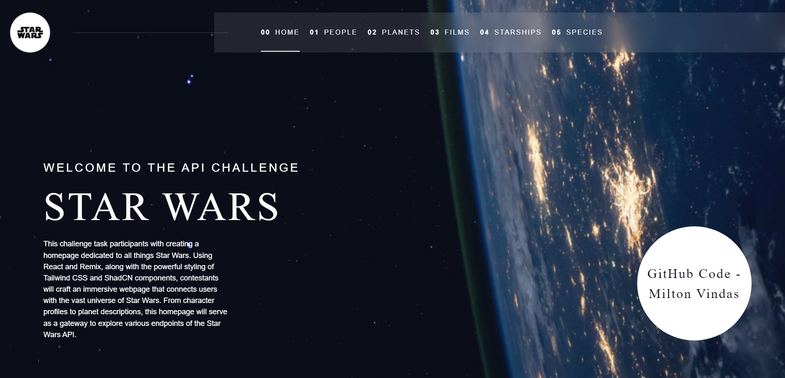
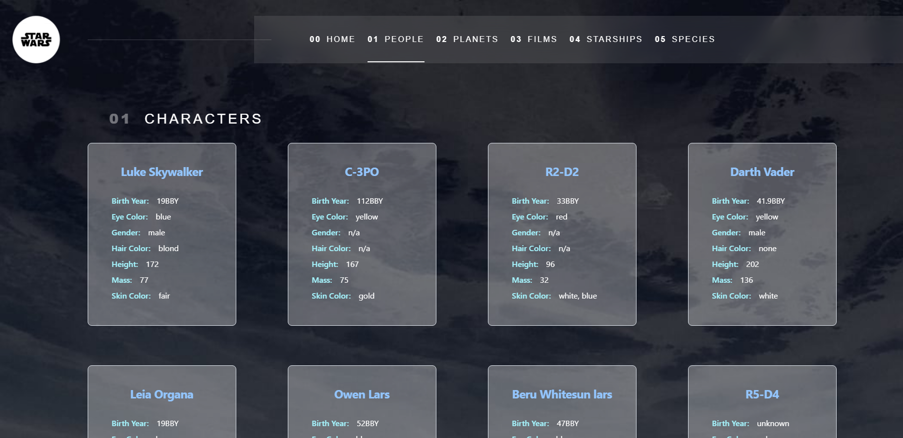

# Star Wars Coding Challenge

This challenge task participants with creating a homepage dedicated to all things Star Wars.  The TechStack required for the challenge is detailed below:

- React
- Remix 
- Tailwind CSS 
- ShadCN Components 
- Star Wars API 
- TypeScript 

## Development & Review

Install dependencies:

```shellscript
npm install
```

Run the Vite dev server:

```shellscript
npm run dev
```

## Features in V1.0

Responsive landing page with routing



People Page using endpoint from Star Wars API to show Star Wars characters cards



Pages .tsx files and styles included, planets data fetch from API, imported ShadCN components available.

